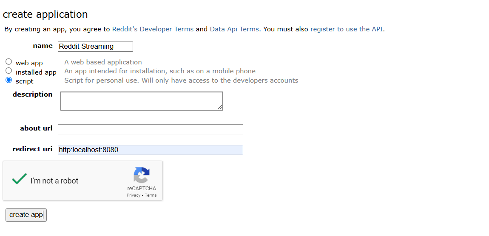
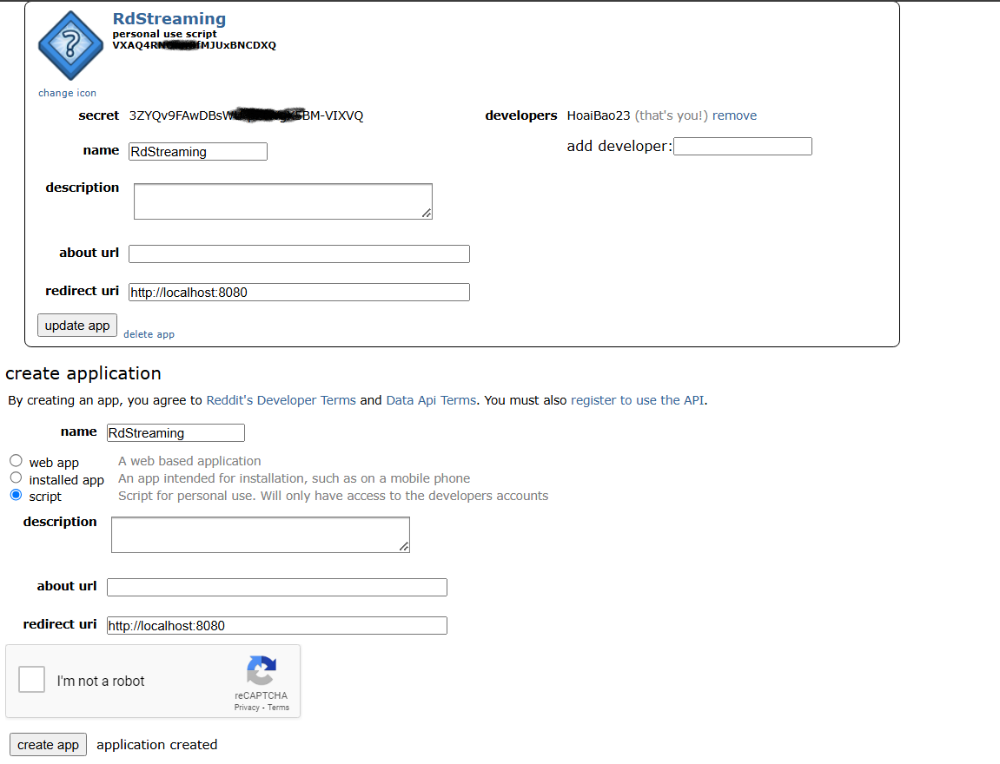

# reddit-streaming
Để tạo thông tin file credentials.cfg:  
  B1: Tạo tài khoản reddit  
  B2: vào link: https://www.reddit.com/prefs/apps  
  B3: Điền các thông và nhấn create app như hình   
  B4: Sau B3 kết quả như hình . Lưu kết quả gồm client_id (dưới dòng personal use script), client_secret (giá trị thuộc tính secret).  
  B5: Điền thông tin file credentials.cfg là 2 giá trị vừa lưu ở trên, giá trị user_agent có thể điền tuỳ ý. Lưu ý điền giá trị vào file credentials.cfg không chứa dấu ""; ví dụ : client_id = abcdef  
  
# test producer:
1. chạy lệnh docker compose up -d  
2. đợi 1 khoảng thời gian, chạy docker ps để kiểm tra status container  
3. cài thư viện trong file requirements.txt và chạy file producer.py  
4. chạy docker exec -it <container_id_or_name> /bin/bash để vào container broker  
5. chạy lệnh: cd /bin và lệnh ./kafka-console-consumer.sh --bootstrap-server localhost:9092 --topic <topic_name> --from-beginning để check đã có message ở topic chưa  
